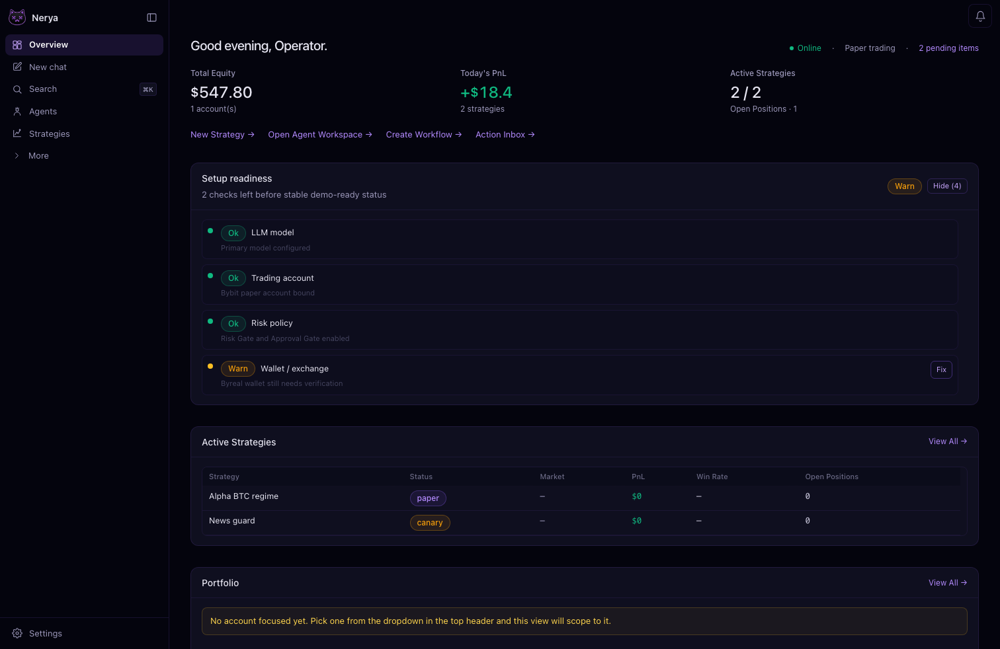
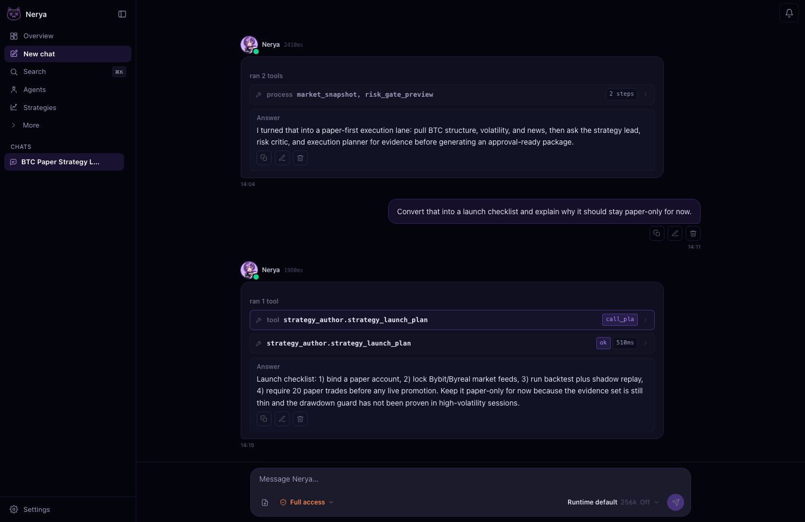
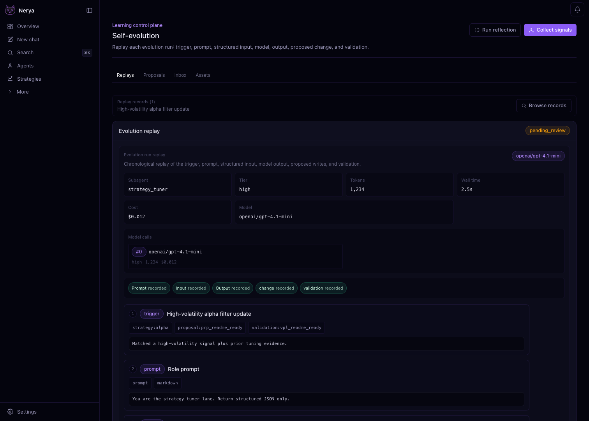

<p align="center">

</p>

<div align="center">

# Nerya

### A local investment-research Agent Team that self-evolves your trading strategies.

Nerya runs a full investment-research desk on your machine. A strategy lead routes the
work while market, on-chain, news, and technical analysts gather the evidence, a risk
critic stress-tests every thesis, and a portfolio manager checks exposure. The desk
drafts strategies, runs them through the Risk Gate and Approval Gate, then turns each
session's evidence into operator-approved patches for prompts, skills, scripts,
triggers, and strategy configs, so every strategy comes back sharper than the last.

[English](README.md) · [简体中文](README.zh-CN.md)

[](https://polyformproject.org/licenses/noncommercial/1.0.0)
[](LICENSE)
[](https://www.python.org/downloads/)


</div>

---

## Latest updates

- **Git and WebDAV workspace sync** — push or pull a Nerya workspace from the
  dashboard or workspace API while keeping runtime state local and explicit.
- **Unified durable memory** — session memory, reflection writes, compaction,
  native tools, and the memory API now share one scoped runtime and projection
  model instead of maintaining separate recall paths.
- **Isolated strategy tuning reviews** — tuning evaluates the selected strategy
  package and its evidence scope without leaking unrelated runtime context into
  the review.
- **Production trading hardening** — derivative orders now carry exchange-aware
  precision, contract sizing, reduce-only, leverage, margin mode, position index,
  and native stop-loss/take-profit parameters through the CCXT bridge.
- **Deeper finance workflows** — new bundled expert-investor, finance-creator,
  and quant-strategy-loop skills add research lenses and repeatable strategy
  iteration without bloating the always-on agent prompt.

---

## From request to evolving strategy

> _"I have **$500** in a paper account. Make me money on BTC. Don't blow it up."_

The strategy lead opens a `TeamRun` from that request. Market, on-chain, news, and
technical analysts gather evidence. The risk critic challenges the plan. The
execution planner writes a runnable strategy package. The portfolio manager checks
exposure before the operator approves the run.

The `strategy_author` skill writes the first package: trigger route, sub-agent
prompts, candle source, account binding, risk limits, and session ledger. Nerya runs
it on paper until you enable live trading and approve the intent.

After the session closes, Nerya journals decisions, reviews fills, writes mistakes
into typed memory, and drafts evolution proposals. You sign or reject each diff.
Applied proposals carry rollback snapshots.

---

## Strategy lifecycle

1. You describe the market, account, budget, and risk limit.
2. The strategy lead assigns research, risk, execution, and portfolio checks.
3. Agents write evidence to the blackboard and pass decisions through the mailbox.
4. The execution planner produces a strategy package with triggers, prompts, data
   sources, limits, and history.
5. The trading kernel submits intents through Risk Gate and Approval Gate.
6. Reflection writes memory. Evolution drafts patches. The operator signs the next
   version.

---

## The six pillars behind the loop

<p align="center">

</p>

---

## Nerya compared

|   | Generic agent frameworks | Nerya |
|---|---|---|
| **Agent work** | Single planner or loose function calls | Durable investment-research desk: strategy lead, market/on-chain/news/technical analysts, risk critic, portfolio manager, shared blackboard, task board, mailbox, gates |
| **Strategy creation** | Manual prompt-to-code handoff | `strategy_author` builds triggers, prompts, data sources, account binding, limits, and ledgers |
| **Strategy evolution** | Operator rewrites prompts after failures | Reflection drafts typed proposals. Operator signs. Runtime applies them with rollback snapshots. |
| **Trading execution** | Tool calls against exchange SDKs | Risk Gate, Approval Gate, paper/live separation, virtual ledger, reconciliation |
| **Memory** | Vector snippets with weak meaning | 5 typed markdown surfaces: global, mistakes, market regimes, skill learnings, per-strategy |
| **Connectors** | One SDK per venue | Binance, Bybit, OKX, Hyperliquid, PancakeSwap, Jupiter, generic EVM, plus 100+ via CCXT. Missing one? Ask the agent to author it. |
| **Security** | Key handling left to each integration | Vault-only secrets, `vault://` refs in context, prompt firewall, signer policy, script sandbox |

---

## Screenshots

### Operator home



Total equity, today's P&L, active strategies, open positions, setup-readiness
checklist (LLM provider, trading account, risk policy, wallet/exchange in green / yellow
/ red), and a live candle chart for the venue you configured.

<br/>

### Agent workspace



> _"Draft a BTC strategy. Run the team review. Paper-trade it. Propose the next version."_

Each message runs one agent turn. The planner picks a route, calls tools, and writes
artifacts to disk. Use the same workspace to create subagents, schedule triggers,
review strategy sessions, and open evolution proposals. Per-message controls:

| Knob          | Purpose                                                            |
|---------------|--------------------------------------------------------------------|
| Think mode    | Force the planner to draft a plan before tool calls                |
| Model tier    | `light` / `medium` / `high` / `intent` for cost vs. capability      |
| YOLO          | Skip extra reviews on cheap turns                                  |
| Iteration cap | Hard ceiling on agent loops per message                            |
| Tool budget   | Maximum tool calls before the kernel ends the turn                 |
| Turn budget   | LLM token budget for this turn                                     |

Starter prompts ship with the workspace: build a monitoring script, create a
subagent, schedule a heartbeat, run a postmortem, and draft a strategy package.

### Self-evolution review desk



Replay the entire evolution run in one place: trigger, role prompt, structured
input, model call, proposed file change, validation preview, optimizer scoring,
and lineage context. This is the operator-facing review surface before any
proposal is approved or promoted.

### Other dashboard surfaces

- `setup` reuses the same onboarding flow as `nerya setup --tui`: password, LLM, gateway, memory, browser, trading account, and web search.
- `skills` treats `SKILL.md` as the definition: browse built-ins, workspace overrides, installed skills, and repo imports from one place.
- `memory` keeps typed notebook entries, evidence, profile state, and optional backends such as `memsearch` or `agentmemory`.
- `portfolio` merges exchange accounts and wallets into one reporting ledger with balances, exposure, reconciliation, and equity history.
- `agents` manages durable role-typed subagents with per-role skill allowlists, prompt overrides, and persistent workspace personas.
- `gateway` centralises Telegram, Discord, Slack, Feishu, WeCom, DingTalk, WhatsApp, and webhook delivery with `vault://` secret refs.

> The dashboard ships under `dashboard/` (Next.js 14, App Router, `:18380`). Run it
> locally with the one-liner below. No cloud account, no telemetry phone-home.

---

## Feature highlights

### Agent Team

A `TeamRun` gives the strategy lead a durable investment-research desk for the trade.
The analysts divide the coverage, the risk critic owns the downside, and the portfolio
manager owns exposure:

- typed members: strategy lead, market analyst, on-chain analyst, news analyst,
  technical analyst, risk critic, execution planner, portfolio manager
- research coverage split across price and regime, on-chain flows, news and sentiment,
  and technicals, then synthesized into one defensible thesis
- per-role skill allowlist + denylist. `execution_planner` cannot touch `trading`
- task board with dependencies, locks, priorities, owners
- mailbox for inter-agent messages, plus a shared blackboard for evidence
- leader synthesis: the lead waits for required reports, resolves conflicts, emits a
  decision memo
- gates: plan-artefact gate, all-tasks-complete gate, verification gate, optional
  human approval gate

Three templates ship today: `market_analysis_team`, `strategy_design_team`,
`trade_decision_committee`. Drop new ones under `nerya/teams/templates`.

### Strategy and agent evolution

Nerya's strategies are not static. Every closed session becomes evidence the agent uses
to sharpen the next version and adapt to the current regime. Nerya keeps strategy code,
prompts, triggers, limits, sessions, and reviews under one workspace. After a strategy
run closes, `nerya/agent/reflection.py` writes memory entries. `nerya/evolution/` reads
those entries and opens typed proposals:

```
learning_update        markdown patch to memory
prompt_patch           unified diff of an agent / subagent prompt
script_proposal        new script + manifest in workspace/scripts/pending/
skill_proposal         new skill directory in workspace/skills/pending/
trigger_route_patch    unified diff to workspace/triggers/routes.yml
strategy_config_patch  unified diff to strategies/<id>/strategy.yml
risk_limit_suggestion  advisory only; never overwrites limits.yml
```

`promotion.py` rejects patches that touch `accounts.yml`, `limits.yml`, the vault,
signer policy, or `live_trading_enabled`. Each applied proposal carries a
`rollback.py` snapshot.

### Memory

```
workspace/memory/
├── global.md                       runtime-wide
├── mistakes.md                     reflection writes, agent reads
├── market_regimes.md               weekly review + news skill
├── skill_learnings.md              per-skill insights
└── strategy_learnings/<id>.md      per-strategy
```

Plain markdown. You can read it, diff it, version-control it. Nothing reaches a prompt
without passing the firewall first.

### Skills

Every capability lives under `nerya/skills/builtin/<name>_skill/`:

```
SKILL.md       when to use, workflow, examples
scripts/       executable helpers, JSON in, JSON out
references/    lazy-loaded methodology and research playbooks
templates/     code and config templates
```

Twenty-five built-ins ship today across five families:

- **Trading & strategy**: `trading`, `strategy_author`, `backtest`, `triggers`, `tasks`
- **Market & data**: `markets`, `market_data_routing`, `news_social`, `research`, `analysis`
- **Research & valuation**: `market_research`, `quant_research`, `equity_research`,
  `dcf_valuation`, `sec_filings`, `research_report`, `expert_investors`
- **Agents, memory & growth**: `agents`, `team`, `memory`, `evolve`, `llm`
- **Build & connect**: `coding`, `browser`, `notify`

The research and valuation family is a full investment-research desk in itself:
multi-source market research, factor and signal validation, equity deep-dives, DCF
valuation, SEC filings, named-investor lenses, and report generation.

### Trading kernel

```
TradeIntent → RiskGate → ApprovalGate → PaperExecution | LiveConnector
                                                 │
                                                 ▼
                              VirtualLedger · positions · PnL · reconciliation
```

- Risk Gate checks live status, limits, ledger, confidence, slippage, staleness,
  duplicates, conflicts. One failure stops the order.
- Approval Gate routes over-threshold intents to the operator queue.
- Strategy History logs trigger, context, decision, intent, risk verdict, execution,
  messages, outcome, review, reflection. One JSONL session per run.
- CCXT adapter for Binance, Bybit, OKX, Hyperliquid. On-chain support: BSC
  (PancakeSwap v2), Solana (Jupiter), generic EVM via `eth_account`.

### Adding a new exchange

Missing a venue? Ask the agent:

> **You:** Add Bitget perpetual futures. Use these API docs: https://bitgetlimited.github.io/apidoc/en/

The `coding` skill checks the CCXT bridge first (100+ venues already wired). For a
supported venue, the agent registers an alias. For a new venue, the agent drops a
`workspace/providers/<id>/provider.py` file with a `SPEC` constant, calls
`ConnectorRegistry.reload_providers()` for hot-reload, and verifies with
`connector_view`. The daemon keeps running. The source tree stays clean. Once the
venue stabilises, a maintainer can lift the workspace file into `nerya/connectors/`.

### Triggers

`workspace/triggers/routes.yml` maps `kind` to a target (main agent, sub-agent, or
direct skill). Built-in kinds: cron, webhook, gateway inbound, price breakout,
funding spike, news keyword, whale wallet, strategy session close, manual operator.
Idempotency keys, dry-run, dedupe are built in.

### Gateway

Telegram, Discord, Slack, Feishu, WeCom, DingTalk, WhatsApp, generic webhook.

- `GET /gateway/platforms` returns the support matrix.
- `POST /gateway/inbound` accepts normalized inbound messages.
- `POST /gateway/send` dispatches outbound through native or webhook channels.
- Trade notifications fan out through `messaging/pipeline.py` to every configured channel.
- Telegram keeps the `typing` indicator open until the agent turn closes.

### SDKs

The SDKs never touch keys, exchanges, or RPCs. They are thin clients over the local
daemon. The daemon enforces every skill permission, risk gate, and approval gate.

```python
from nerya_sdk import connect

client = connect()
client.triggers.emit(
    source="script",
    kind="price.breakout",
    payload={"symbol": "BTC", "price": 82_000},
    target="subagent:market_analyst",
    strategy_id="btc_momentum",
)
```

```ts
import { connect } from "@nerya/sdk";

const nerya = connect({ baseUrl: "http://127.0.0.1:18317", caller: "script:my_bot" });
await nerya.trading.submitIntent({
  strategy_id: "btc_momentum",
  account_id: "paper_main",
  market: "PAPER:BTCUSDT",
  side: "buy",
  size: 0.01,
  size_unit: "base",
  order_type: "market",
  confidence: 0.6,
  reasoning: "ts-sdk demo",
});
```

---

## Quick start

### One-liner install

```bash
# macOS / Linux
curl -LsSf https://raw.githubusercontent.com/NeryaAI/Nerya/main/install/install.sh | sh

# Windows PowerShell
iwr https://raw.githubusercontent.com/NeryaAI/Nerya/main/install/install.ps1 -UseBasicParsing | iex
```

If the repo is still private, anonymous `raw.githubusercontent.com` requests will
return `404`. The commands above are the canonical public-launch URLs.

The installer is idempotent. It:

1. installs [`uv`](https://github.com/astral-sh/uv) if missing,
2. clones Nerya into `~/.nerya/src` and runs `uv sync --extra trading`,
3. drops a `nerya` shim into `~/.local/bin` (POSIX) or `%USERPROFILE%\.local\bin` (Windows),
4. initialises a workspace at `~/nerya-ws`,
5. registers a host service (`systemd --user`, `launchd`, or NSSM) so the local API
   boots with the machine on port `18317`.

### Beginner mode

```bash
nerya setup --tui      # rich text wizard for password, LLM key, gateway, memory, account
nerya setup --web      # same wizard in the browser at http://127.0.0.1:18317/setup
```

Every domain except the LLM model carries a safe default. Hit Enter through every
prompt and you get a working install. Then open the dashboard and chat:

> **You:** I have $500 in a paper account. Make me money on BTC. Don't blow it up.
>
> **Nerya:** _Starts a `TeamRun`, gathers analyst notes, drafts a
> `demo_btc_5m_scalper` strategy package, wires up `binance:BTCUSDT` candles, binds
> `paper_main`, sets a 0.4% max-drawdown guard, schedules the trigger every 5
> minutes, and asks you to approve._

### Manual quick start (no installer)

```bash
# 1. create a workspace
python -m nerya.cli.app init --workspace ~/.nerya

# 2. inspect installed skills
python -m nerya.cli.app skill list

# 3. run the vertical slice demo (paper trading, no live keys)
python sdk/python/examples/price_tracker.py --workspace ~/.nerya

# 4. review the resulting strategy session
python -m nerya.cli.app strategy history btc_momentum --workspace ~/.nerya

# 5. reflect and generate evolution proposals
python -m nerya.cli.app reflect  --workspace ~/.nerya
python -m nerya.cli.app evolve   --workspace ~/.nerya
python -m nerya.cli.app proposals list --workspace ~/.nerya
```

### Open the local dashboard (Windows)

```powershell
pwsh -File .\scripts\windows\start-local.ps1 -OpenDashboard
```

The launcher is idempotent. Re-run it whenever. API on `:18317`, dashboard on
`:18380`, logs in `~/.nerya/logs/`.

---

## Architecture

```
┌──────────────────────────── Nerya runtime ────────────────────────────┐
│                                                                        │
│   ┌──────────────────┐   ┌─────────────┐   ┌──────────────────────┐    │
│   │ Trigger router   │──►│ Nerya kernel│──►│ Skills runtime         │   │
│   │ schedule / NL /  │   │  agent loop │   │ registry + dispatch    │   │
│   │ webhook / gateway│   │  + planner  │   │ permissions + manifest │   │
│   └──────────────────┘   └──────┬──────┘   └───────────┬──────────┘    │
│                                 │                      │               │
│                                 ▼                      ▼               │
│   ┌─────────────┐   ┌─────────────┐   ┌──────────────────────────┐    │
│   │ LLM gateway │   │ Subagents + │   │  Trading kernel           │   │
│   │ tiers +     │   │ Agent Team  │   │  intents → Risk Gate →    │   │
│   │ budget +    │   │ blackboard +│   │  Approval Gate →           │   │
│   │ adapters    │   │ mailbox     │   │  paper / live execution    │   │
│   └─────────────┘   └─────────────┘   └──────────────┬───────────┘    │
│                                                       │               │
│   ┌─────────────┐   ┌─────────────┐   ┌──────────┐   │               │
│   │ Messaging   │   │ Security    │   │ MCP /    │   │               │
│   │ Gateway     │   │ vault +     │   │ ACP      │   │               │
│   │ pipeline    │   │ signer +    │   │ bridges  │   │               │
│   │             │   │ firewall    │   │          │   │               │
│   └─────────────┘   └─────────────┘   └──────────┘   ▼               │
│                              Strategy history + journals + proposals  │
└────────────────────────────────────────────────────────────────────────┘
                                    │
                                    ▼
┌───────────────────────── Nerya workspace (files only) ────────────────┐
│  state/ journals/ inbox/ outbox/ memory/ vault/ approvals/             │
│  strategies/<id>/{strategy.yml, limits.yml, history/, sessions/}       │
│  skills/{enabled.yml, installed/, pending/}                            │
│  scripts/{pending/, approved/, rejected/}                              │
│  evolution/proposals/                                                  │
└────────────────────────────────────────────────────────────────────────┘
```

Code lives in the repo. Runtime state (strategies, journals, sessions, approvals,
memory, vault, proposals) lives in your workspace directory. Tarball it, grep it,
or `rm -rf` it.

---

## SDKs

| Surface  | Path                                  | Purpose                                                                     |
|----------|---------------------------------------|-----------------------------------------------------------------------------|
| Python   | `sdk/python/nerya_sdk/`               | Thin client over the local daemon. Triggers, trading, LLM, strategy, memory. |
| TypeScript | `sdk/typescript/` → `@nerya/sdk`    | Same surface. Node, Bun, and Edge friendly.                                  |
| MCP      | `nerya/mcp/`                          | Exposes every skill as an MCP tool for Claude Desktop, Cursor, etc.         |
| ACP      | `nerya/acp/`                          | Agent-to-agent bridges for inter-swarm communication.                        |

```bash
# Python SDK examples
python sdk/python/examples/price_tracker.py          # trigger → sub-agent → paper fill
python sdk/python/examples/news_alpha_watcher.py     # light + high LLM filter chain
python sdk/python/examples/direct_order_strategy.py  # direct order, still via Risk Gate
python sdk/python/examples/funding_spike_trigger.py  # perp funding spike trigger
python sdk/python/examples/whale_wallet_trigger.py   # whale wallet activity trigger
```

---

## Safety

- Paper trading is the default. Live trading stays off unless
  `runtime.live_trading_enabled: true` **and** the Approval Gate signs off.
- No raw secrets reach agent context. Only `secret_ref` and redacted previews.
  `SecretVault` resolves `vault://` refs in-memory for one call, then discards them.
- No direct exchange calls from agent-authored code. Every external call goes through
  a registered skill, then a connector, then a signer.
- Scripts run in a sandbox: whitelisted imports, JSON I/O, manual approval before
  first run, no bypass of Trading SDK or Risk Gate.
- Evolution can mutate prompts, scripts, skills, routes, strategy configs. It cannot
  mutate `limits.yml`, `live_trading_enabled`, signer policy, or secret policy.
  `promotion.py` rejects protected diffs.

---

## Repo modules

| Module               | Role                                                                                                |
|----------------------|-----------------------------------------------------------------------------------------------------|
| `agent/`             | Kernel, planner, context builder, memory, working memory, reflection                                |
| `subagents/`         | Per-role runtimes with skill allow/denylists, budget caps, parallel dispatcher, result aggregator   |
| `teams/`             | Durable Agent Team: config, store, mailbox, blackboard, templates, orchestrator, gates, aggregator  |
| `triggers/`          | Cron + trigger router, `schedules.yml`, idempotency, dry-run                                        |
| `skills/`            | `SKILL.md` kernel + 25 built-in skills across trading, data, investment research, agents, and build |
| `trading/`           | TradeIntent, RiskGate, ApprovalGate, paper execution, virtual ledger, positions, PnL, reconciliation |
| `connectors/`        | CCXT adapter (Binance/Bybit/OKX/Hyperliquid), native EVM/BSC/Solana, dynamic provider spec          |
| `wallet/`            | Self-custody, OKX OS, Bitget, Binance Agentic, Coinbase wallet providers                            |
| `llm/`               | ModelRouter, OpenAI/Anthropic/Gemini/Ollama adapters, credential pool, compression, tiers, budget   |
| `security/`          | Vault, signer, prompt firewall, redaction, structured-output validator, script sandbox              |
| `evolution/`         | Reflection engine, typed proposals, operator-signed promotion, snapshot rollback                    |
| `strategy_history/`  | Per-strategy JSONL ledgers, session artifacts, replay                                                |
| `messaging/`         | Universal gateway: Telegram, Discord, Slack, Feishu, WeCom, DingTalk, WhatsApp, webhooks            |
| `mcp/`, `acp/`       | FastMCP server + ACP adapter for bridging skills to external agent ecosystems                       |
| `install/`           | Cross-platform service (systemd, launchd, NSSM) installer                                           |
| `sdk/`               | In-process InternalClient + Trigger, Trading, LLM, Strategy, Message, Skill surfaces                |

---

## Run the tests

```bash
python -m pytest tests/
```

500+ tests cover: skill manifests, trigger router (dedupe, dry-run, sub-agent
routing), schedule operator lifecycle, Trading SDK (risk gate, kill switch, over-size,
paper fill, strategy session creation), LLM gateway and OpenRouter-style routing,
model catalog refresh, secret redaction, script sandbox, reflection and evolution,
strategy history and explain-trade, sub-agent and agent-kernel turns, dynamic
connector discovery, CEX live-signed order placement (Binance, Bybit, OKX,
Hyperliquid), DEX live-signed swaps (BSC PancakeSwap, Solana Jupiter), MCP and ACP
adapters, dev-mode journaling, and the service installer.

The suite runs without network. LLM adapters use `FakeTransport`. Exchanges use
`mock_exchange.py` and `mock_chain.py`. End-to-end LLM behavior is driven by
deterministic `<<MOCK_DECISION:{…}>>` hooks.

---

## Ports

One local port by default: `18317`. Local daemon, host service, dashboard proxy,
SDK target all share it. Pass `--port` to `nerya serve` or `nerya service install`
and point the dashboard and SDKs at the new URL via the `NERYA_API` environment
variable.

---

## Status

- ✅ Vertical slice end-to-end: `init → skill list → trigger → sub-agent turn →
  TradeIntent → Risk Gate → paper fill → strategy history → review → reflect →
  proposals`.
- ✅ Agent Team Phase 1–4 live: durable team core, templates, orchestrator,
  planner/kernel integration, skill and HTTP surface. Phase 5
  (snapshot/replay/team-close memory) deferred.
- ✅ CEX live-signed order placement and cancellation for Binance, Bybit, OKX, and
  Hyperliquid. DEX swaps for BSC PancakeSwap v2 and Solana Jupiter.
- ✅ Cross-platform one-line installer with service registration.
- ✅ Dashboard (Next.js 14): Setup wizard, Chat, Strategies, Evolution, Memory,
  Skills, Workflows, Inbox, Portfolio, Gateway, Env Vault, Settings.
- 🚧 Agent Team Phase 5: snapshot and replay.
- 🚧 More native gateway adapters: Feishu rich cards, Discord slash commands,
  WhatsApp Business.

---

## License

Nerya is released under the [PolyForm Noncommercial License 1.0.0](https://polyformproject.org/licenses/noncommercial/1.0.0).
The full text lives in [`LICENSE`](LICENSE).

- ✅ **Free for personal use**: study, research, hobby projects, experiments,
  writing papers, running it against your own paper or live account with your
  own money. Read it, modify it, fork it, share it.
- ✅ **Free for nonprofits, schools, and public-interest organizations**: the
  license is explicit about this.
- ❌ **Commercial use needs a separate license**, including hosting Nerya as a
  managed/SaaS service, embedding it in a paid product, running it inside a
  for-profit firm's trading or fund-management operations, or selling
  Nerya-powered strategy execution to third parties.

Need a commercial license? Open a GitHub issue describing your use case, or email
the maintainers. See the [Commercial Use Addendum](LICENSE) at the end of the
LICENSE file.

---

<div align="center">

Built for operators who want a local Agent Team that can research, trade, learn
from its mistakes, and evolve its own strategies, without ever handing over the
hot keys.

<sub>Nerya · Evolutionary Brain</sub>

</div>
