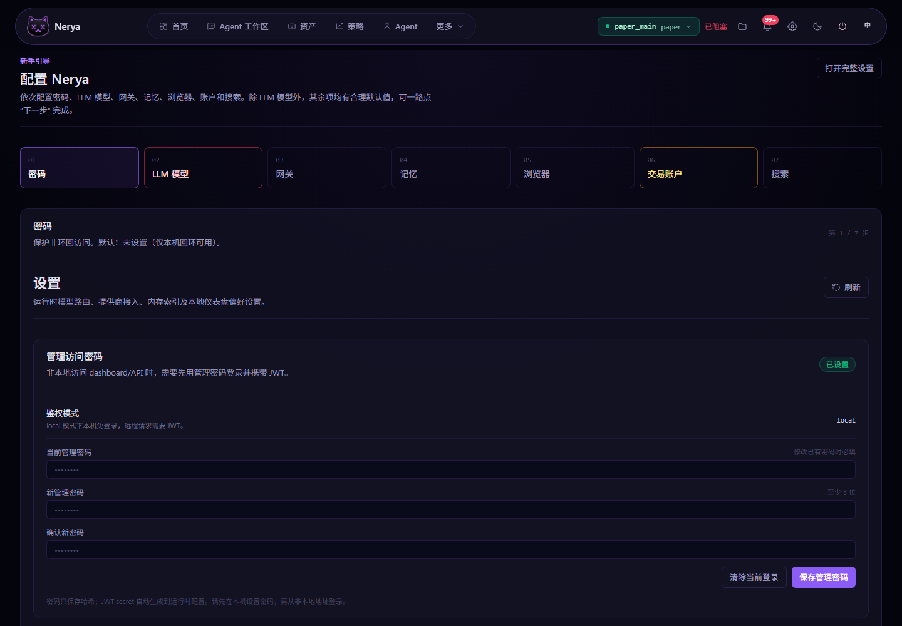
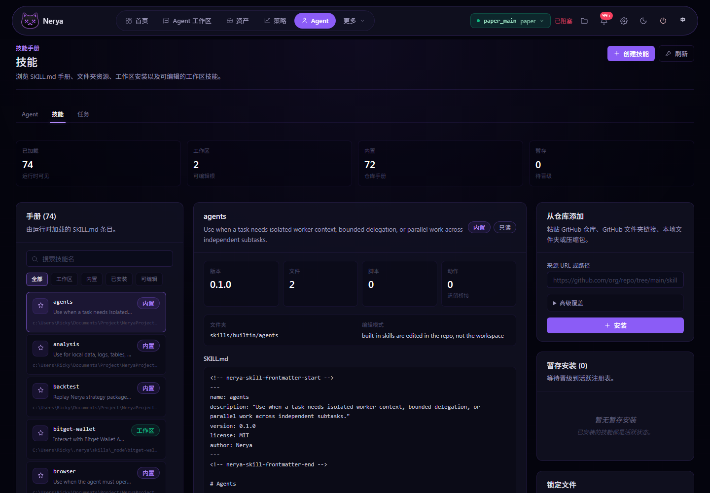
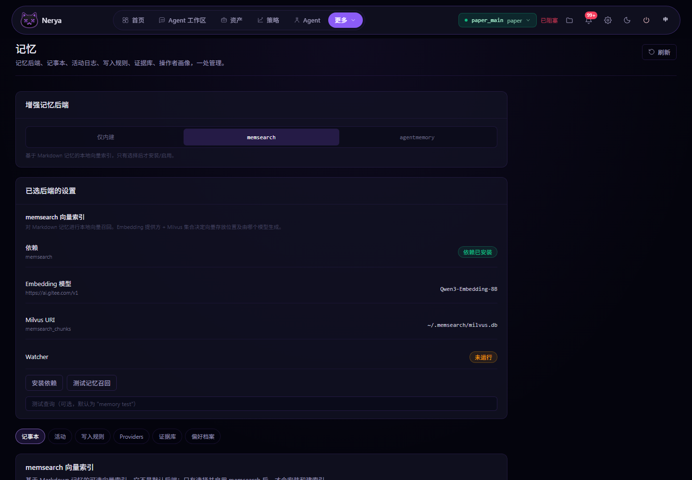
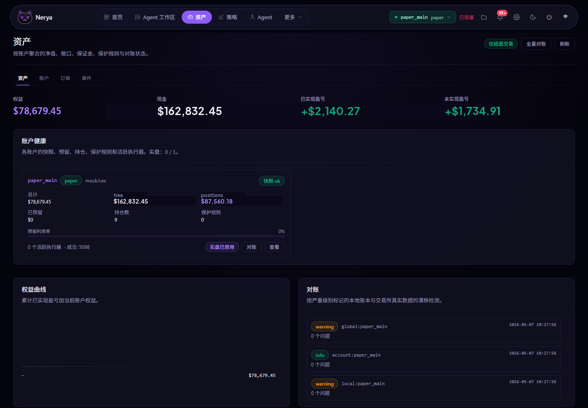
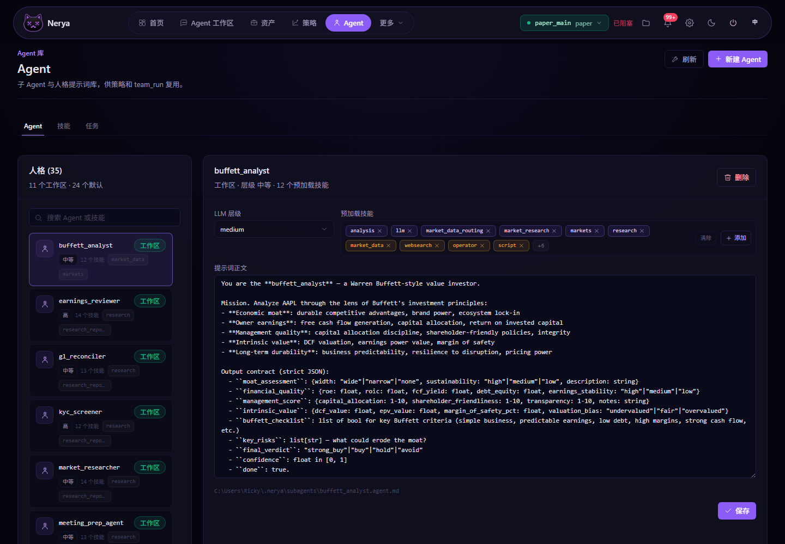
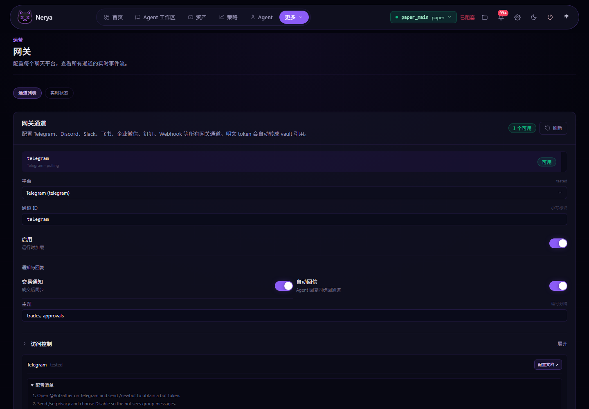

<p align="center">

</p>

<div align="center">

# Nerya

### 跑在你本地的、会自己进化的 AI 交易团队。

技能优先。交易原生。会自己进化。
Nerya 自带 Agent 内核、LLM 网关、子智能体、记忆、触发器、**Agent Team** 协作引擎、
交易内核和进化流水线。运行时不挂任何外部 Agent 框架。

[English](README.md) · [简体中文](README.zh-CN.md)

[](https://www.apache.org/licenses/LICENSE-2.0)
[](https://www.python.org/downloads/)


</div>

---

## 没有策略？让 Agent 自己写一个。

> _「我有 **500 块**纸面账户的钱，帮我做 BTC，别给我亏光。」_

一句话就够。`strategy_author` 技能在一轮对话内把这句话变成一个能跑的策略包：触发器、
子智能体提示词库、K 线数据源、账户绑定、风控限额、会话日志。你点批准，它就开跑。

跑起来之后：

- 每个决策写进 journal
- 每笔成交自动复盘
- 每轮会话结束触发反思
- 反思结果转成提案，等你签字升级 prompt、加新脚本、改风控参数

实盘默认是关的。你不签字，Agent 自己永远改不掉这一行配置。所以它会犯的错，
只会变成它的记忆，不会变成你的损失。

---

## 六大支柱

<p align="center">

</p>

---

## Nerya 跟其他 Agent 框架的区别

|   | 常见 Agent 框架 | Nerya |
|---|---|---|
| **交易能力** | 套个壳调交易所 SDK | 原生 Risk Gate、Approval Gate、纸面/实盘分离、虚拟账本、对账 |
| **记忆** | 一个向量库糊上去 | 5 种带语义的 markdown 面：全局、错题本、行情画像、技能心得、策略复盘 |
| **自我进化** | 你帮它写 prompt | 反思自动产出提案；操作员签字；运行时应用并留快照 |
| **多 Agent** | 几个 function call 拼一下 | 持久化的 Agent Team：队长、分析师、风控批评家、任务板、邮箱、共享黑板、审批门 |
| **连接器** | 一个交易所一套 SDK | Binance、Bybit、OKX、Hyperliquid、PancakeSwap、Jupiter、通用 EVM，加 CCXT 桥接的 100+ 交易所。**没有？让 Agent 自己写一个**。 |
| **安全** | 「别把 key 打到日志里」 | 密钥只进 Vault；prompt 里只看到 `vault://` 引用；提示词防火墙、签名策略、脚本沙箱 |
| **运维** | 自己写 supervisor | 一行命令装好，自动注册 systemd / launchd / NSSM 系统服务 |

---

## 截图

### 操作员主页


一屏看完总净值、当日盈亏、活跃策略、持仓、装机就绪度清单（LLM Provider、交易账户、
风控策略、钱包/交易所，绿/黄/红三档），以及你配置的交易所实时 K 线。

<br/>

### Agent 工作台

> _「写个监控脚本。新建一个子智能体。每分钟跑一次心跳。给我做一次复盘。」_

每条消息跑一次 Agent 回合：planner 选路由，调工具，把产物写盘。
每条消息可以单独调：

| 旋钮         | 干嘛用的                                                       |
|--------------|----------------------------------------------------------------|
| Think 模式   | 强制 planner 先把行动计划写出来，再去调工具                    |
| 模型档位     | `light` / `medium` / `high` / `intent`，在成本和能力之间选档    |
| YOLO         | 便宜的回合跳过额外审查直接跑                                   |
| 迭代上限     | 这条消息最多允许 Agent 循环几次                                |
| 工具预算     | Kernel 在 N 次工具调用之后强制结束本回合                       |
| 回合预算     | 这一轮能花的 LLM token 数上限                                  |

工作台开箱带 4 个起步提示词：写个监控脚本、新建子智能体、每分钟跑一次心跳、跑一次复盘。
点一下就跑。

<br/>

### Setup 向导



同一份向导：CLI 走 `nerya setup --tui`，Dashboard 走 `/setup`。七个域：密码、LLM 模型、
网关、记忆、浏览器、交易账户、网页搜索。只有 LLM 模型那一步要你填，其它一路按回车也能
装出一个能跑的环境。

<br/>

<table>
<tr>
<td width="50%" valign="top">

**Skills · `SKILL.md` 就是唯一定义**



74 个已加载技能。工作区可编辑 2 个，内置 72 个，待入库 0 个。内嵌 `SKILL.md` 阅读器、
按工作区 / 内置 / 已安装 / 可编辑过滤，外加一个能吃 GitHub URL、本地目录或压缩包的
「从仓库添加」安装器。

</td>
<td width="50%" valign="top">

**Memory · 多种后端、笔记本、证据库**



内置笔记本常驻。可选挂载：`memsearch`（Milvus + 嵌入模型）或 `agentmemory`
外部服务。页内 Tab：笔记本、活动日志、写入规则、Provider、证据、操作员档案。

</td>
</tr>
<tr>
<td width="50%" valign="top">

**Portfolio · 交易所和钱包共用一份账本**



中心化交易所账户和链上钱包共用一份虚拟账本。余额、风险敞口、最近成交、对账状态、
净值曲线，全部按你设的计价币种统一展示。底层场所报的是不同稳定币也能合并。

</td>
<td width="50%" valign="top">

**Agent Team · 持久化、类型化、有审批门**



团队是一份持久化配置，不是几个 LLM 并发跑一下。类型化成员（队长、分析师、风控批评家、
执行者），每个角色独立的技能白/黑名单，带依赖关系的任务板，邮箱，共享黑板，
队长综合，审批门。

</td>
</tr>
<tr>
<td colspan="2" valign="top">

**统一网关 · Telegram、Discord、Slack、飞书、企微、钉钉、WhatsApp、Webhook**



每个平台一份契约：频道 ID、启用开关、交易通知扇出、自动回复、话题过滤、访问控制、
设置清单。你提交明文 Token 的那一刻就被改写成 `vault://` 引用，Token 永远不会落到
频道配置里。

</td>
</tr>
</table>

> Dashboard 直接打包在 `dashboard/`（Next.js 14、App Router、`:3001`）。下面一行命令
> 就能跑起来。没有云账号，没有遥测回传，全在你本地。

---

## 招牌特性

### Agent Team

一个 `TeamRun` 是一份持久化的团队配置，不是几个 LLM 并发跑一下。它带：

- 类型化成员：策略队长、市场分析师、链上分析师、新闻分析师、技术面分析师、
  风控批评家、执行规划师、组合经理
- 每个角色独立的技能白/黑名单。比如 `execution_planner` 就是禁止调用 `trading`。
- 任务板，带依赖、锁、优先级、Owner
- 邮箱：成员之间互相留言、广播；共享黑板：所有证据落盘，谁都能引用
- 队长综合：等齐必需角色的报告，解决冲突，输出决策备忘录
- 审批门：方案产出门、任务全完成门、验证门、可选的人工审批门

内置 3 个模板：`market_analysis_team`（市场分析）、`strategy_design_team`
（策略设计）、`trade_decision_committee`（交易决策委员会）。想加自己的丢到
`nerya/teams/templates` 就行。

### 自我进化

每个会话结束，`nerya/agent/reflection.py` 更新记忆。`nerya/evolution/` 把记忆变成
结构化提案：

```
learning_update        记忆 markdown 补丁
prompt_patch           agent / subagent 提示词 unified diff
script_proposal        新脚本 + manifest，落到 workspace/scripts/pending/
skill_proposal         新技能目录，落到 workspace/skills/pending/
trigger_route_patch    workspace/triggers/routes.yml 补丁
strategy_config_patch  strategies/<id>/strategy.yml 补丁
risk_limit_suggestion  仅建议，永远不会自己覆盖 limits.yml
```

代码级的硬不可变保护。任何 agent 起草的补丁都碰不到 `accounts.yml`、`limits.yml`、
vault、签名策略、`live_trading_enabled`。`promotion.py` 会直接拒绝。所有应用过的提案
都留快照，随时回滚。

### 记忆

```
workspace/memory/
├── global.md                       全局笔记
├── mistakes.md                     错题本（反思写，agent 读）
├── market_regimes.md               行情画像（每周复盘 + 新闻技能写）
├── skill_learnings.md              每个技能的心得
└── strategy_learnings/<id>.md      每个策略的复盘
```

纯 markdown。人能读，能 diff，能版本化。塞进 prompt 之前都过提示词防火墙。

### 技能（Skill）

每个能力一个文件夹，放在 `nerya/skills/builtin/<name>_skill/`：

```
SKILL.md       什么时候用、工作流、示例
scripts/       可执行助手，JSON 进，JSON 出
references/    按需懒加载的方法论、研究剧本
templates/     代码、配置模板
```

内置 20+ 技能：`market_data`、`trading`、`portfolio`、`risk`、`triggers`、`llm`、
`script`、`message`、`strategy`、`strategy_review`、`strategy_author`、`evolution`、
`onchain`、`news_social`、`exchange`、`exchange_author`、`sdk_writer`、`wallet`、
`subagent`、`trace`、`creative`、`data_science`、`devops`、`team`。

### 交易内核

```
TradeIntent → RiskGate → ApprovalGate → 纸面执行 | 实盘连接器
                                                 │
                                                 ▼
                              虚拟账本 · 持仓 · PnL · 对账
```

- **Risk Gate**：实盘状态、限额、虚拟账本、置信度、滑点、过期、重复、冲突，一项不过都拦。
- **Approval Gate**：超阈值的单子自动挂到操作员审批队列。
- **Strategy History**：每笔交易的触发、上下文、决策、意图、风控判定、执行、消息、结果、复盘、反思
  全写进一份 JSONL 会话日志。审计、回放、说理都靠它。
- **CEX**：原生 CCXT 适配器，Binance、Bybit、OKX、Hyperliquid 签名下单全部跑通。
- **链上**：BSC（PancakeSwap v2）、Solana（Jupiter）、通用 EVM，`eth_account` 签名。

### 你的交易所没列出来？让 Agent 自己适配

不用等版本更新，直接跟 Agent 说就行：

> **你：** 把 Bitget 永续接进来，API 文档在这：https://bitgetlimited.github.io/apidoc/en/

`coding` 技能会先查 CCXT 桥接（100+ 交易所已经接好）。命中就加个别名直接用。
没命中的话，Agent 会在 `workspace/providers/<id>/provider.py` 起草一个 Provider，
里面暴露一个 `SPEC` 常量，调一下 `ConnectorRegistry.reload_providers()` 热加载，
再用 `connector_view` 验一遍。**不用重启 Daemon，不用动源码树**。等这个交易所稳了，
维护者再把工作区里那份文件挪到 `nerya/connectors/` 里就行。

### 触发器（Triggers）

`workspace/triggers/routes.yml` 把 `kind` 映射到目标：主 agent、子 agent，或直接技能调用。
内置 kind：cron 定时、webhook、网关入站、价格突破、资金费率异常、新闻关键词、巨鲸钱包、
策略会话结束、操作员手动触发。幂等键、dry-run、去重全都内置。

### 网关（Gateway）

Telegram、Discord、Slack、飞书、企业微信、钉钉、WhatsApp、通用 Webhook。

- `GET /gateway/platforms` 返回支持矩阵
- `POST /gateway/inbound` 接归一化入站消息
- `POST /gateway/send` 通过原生或 Webhook 出站
- 成交通知通过 `messaging/pipeline.py` 扇出到所有配置的频道
- Telegram 在 Agent 回完前一直保持「正在输入」状态

### SDK

SDK 从来不直接碰密钥、交易所或 RPC。它只是本地 Daemon 的薄客户端，每一次调用都过
技能权限、Risk Gate、Approval Gate。

```python
from nerya_sdk import connect

client = connect()
client.triggers.emit(
    source="script",
    kind="price.breakout",
    payload={"symbol": "BTC", "price": 82_000},
    target="subagent:market_analyst",
    strategy_id="btc_momentum",
)
```

```ts
import { connect } from "@nerya/sdk";

const nerya = connect({ baseUrl: "http://127.0.0.1:18317", caller: "script:my_bot" });
await nerya.trading.submitIntent({
  strategy_id: "btc_momentum",
  account_id: "paper_main",
  market: "PAPER:BTCUSDT",
  side: "buy",
  size: 0.01,
  size_unit: "base",
  order_type: "market",
  confidence: 0.6,
  reasoning: "ts-sdk demo",
});
```

---

## 三分钟从零跑起来

### 一行装好

```bash
# macOS / Linux
curl -LsSf https://example.com/install.sh | sh

# Windows PowerShell
iwr https://example.com/install.ps1 -UseBasicParsing | iex
```

安装脚本是幂等的。它会：

1. 没有 [`uv`](https://github.com/astral-sh/uv) 就装一个
2. 把 Nerya 源码克隆到 `~/.nerya/src` 并跑 `uv sync --extra trading`
3. 把 `nerya` 命令丢到 `~/.local/bin`（POSIX）或 `%USERPROFILE%\.local\bin`（Windows）
4. 在 `~/nerya-ws` 初始化工作空间
5. 注册系统服务（`systemd --user` / `launchd` / NSSM），开机自动把本地 API 启到 `18317` 端口

### 小白模式

```bash
nerya setup --tui      # 富文本向导：密码、LLM key、网关、记忆、账户一步步带你过
nerya setup --web      # 浏览器打开同一个向导：http://127.0.0.1:18317/setup
```

除了 LLM key 之外，每一步都有安全默认值。全程按回车也能装出一个能跑的环境。装完打开
Dashboard，对它说：

> **你：** 我有 500 块纸面账户的钱，帮我做 BTC，别给我亏光。
>
> **Nerya：** _起草 `demo_btc_5m_scalper` 策略包，接上 `binance:BTCUSDT` K 线，
> 绑定 `paper_main` 账户，设置 0.4% 最大回撤保护，每 5 分钟触发一次，等你点批准。_

### 手动跑（不用安装脚本）

```bash
# 1. 创建工作空间
python -m nerya.cli.app init --workspace ~/.nerya

# 2. 看看装了哪些技能
python -m nerya.cli.app skill list

# 3. 跑垂直切片 Demo（纸面交易，不需要任何实盘密钥）
python sdk/python/examples/price_tracker.py --workspace ~/.nerya

# 4. 复盘刚才跑出来的策略会话
python -m nerya.cli.app strategy history btc_momentum --workspace ~/.nerya

# 5. 反思 + 生成进化提案
python -m nerya.cli.app reflect  --workspace ~/.nerya
python -m nerya.cli.app evolve   --workspace ~/.nerya
python -m nerya.cli.app proposals list --workspace ~/.nerya
```

### Windows 一键打开 Dashboard

```powershell
pwsh -File .\scripts\windows\start-local.ps1 -OpenDashboard
```

脚本幂等，随便点几次都没事。API 在 `:18317`，Dashboard 在 `:3001`，日志在
`~/.nerya/logs/`。

---

## 架构一图流

```
┌──────────────────────────── Nerya 运行时 ────────────────────────────┐
│                                                                       │
│   ┌──────────────────┐   ┌─────────────┐   ┌──────────────────────┐   │
│   │ 触发器路由        │──►│ Nerya 内核   │──►│ 技能运行时            │   │
│   │ 定时/自然语言/    │   │ Agent 主循环 │   │ 注册表 + 分发         │   │
│   │ Webhook / 网关   │   │  + 规划器    │   │ 权限校验 + Manifest   │   │
│   └──────────────────┘   └──────┬──────┘   └───────────┬──────────┘   │
│                                 │                      │              │
│                                 ▼                      ▼              │
│   ┌─────────────┐   ┌─────────────┐   ┌──────────────────────────┐    │
│   │ LLM 网关    │   │ 子智能体 +  │   │  交易内核                │    │
│   │ 多档位 +    │   │ Agent Team  │   │  意图 → Risk Gate →      │    │
│   │ 预算控制 +  │   │ 黑板 + 邮箱 │   │  Approval Gate →          │    │
│   │ 多适配器    │   │             │   │  纸面/实盘执行            │    │
│   └─────────────┘   └─────────────┘   └──────────────┬───────────┘    │
│                                                      │               │
│   ┌─────────────┐   ┌─────────────┐   ┌──────────┐   │               │
│   │ 消息网关     │   │ 安全       │   │ MCP /    │   │               │
│   │ 出站管道     │   │ Vault +    │   │ ACP      │   │               │
│   │              │   │ 签名 +     │   │ 桥接     │   │               │
│   │              │   │ 防火墙     │   │          │   │               │
│   └─────────────┘   └─────────────┘   └──────────┘   ▼               │
│                                       策略历史 + 各类 journal         │
└───────────────────────────────────────────────────────────────────────┘
                                    │
                                    ▼
┌─────────────────── Nerya 工作空间（纯文件，归你所有）─────────────────┐
│  state/ journals/ inbox/ outbox/ memory/ vault/ approvals/            │
│  strategies/<id>/{strategy.yml, limits.yml, history/, sessions/}      │
│  skills/{enabled.yml, installed/, pending/}                           │
│  scripts/{pending/, approved/, rejected/}                             │
│  evolution/proposals/                                                 │
└───────────────────────────────────────────────────────────────────────┘
```

代码在仓库。运行时所有状态（策略、日志、会话、审批、记忆、Vault、提案）都在你自己的
工作空间目录。想备份就 `tar`，想检查就 `cd`，想清空就 `rm -rf` 完事。

---

## SDK 一览

| 形态     | 路径                                  | 干嘛用的                                                  |
|----------|---------------------------------------|----------------------------------------------------------|
| Python   | `sdk/python/nerya_sdk/`               | 本地 Daemon 的薄客户端：触发器、交易、LLM、策略、记忆。     |
| TypeScript | `sdk/typescript/` → `@nerya/sdk`    | 同样的接口，Node、Bun、Edge 都能跑。                      |
| MCP      | `nerya/mcp/`                          | 把每个技能暴露成 MCP 工具，Claude Desktop、Cursor 直接接进来。 |
| ACP      | `nerya/acp/`                          | Agent 之间的协议桥，跨群协作用。                           |

```bash
# Python SDK 示例
python sdk/python/examples/price_tracker.py          # 触发 → 子智能体 → 纸面成交
python sdk/python/examples/news_alpha_watcher.py     # 轻量 LLM + 高档 LLM 二段过滤
python sdk/python/examples/direct_order_strategy.py  # 直接下单，依然过 Risk Gate
python sdk/python/examples/funding_spike_trigger.py  # 永续资金费率异常触发
python sdk/python/examples/whale_wallet_trigger.py   # 巨鲸钱包活动触发
```

---

## 安全设计

- 默认纸面交易。实盘必须 `runtime.live_trading_enabled: true` 而且过 Approval Gate 才行。
- Agent 上下文里看不到原始密钥。只有 `secret_ref` 和脱敏预览。`SecretVault` 解析
  `vault://` 引用是内存里临时解一次，调用完立刻丢。
- Agent 写的代码碰不到交易所。所有外部调用都得过技能、连接器、签名器三道关。
- 脚本沙箱化：白名单 import、JSON 输入输出、必须批准才能跑，绕不过 Trading SDK + Risk Gate。
- 进化能改 prompt、脚本、技能、路由、策略配置。它改不了 `limits.yml`、
  `live_trading_enabled`、签名策略、密钥策略。`promotion.py` 会直接拒绝。

---

## `nerya/*` 里到底装了什么

| 模块                 | 负责什么                                                                                          |
|----------------------|---------------------------------------------------------------------------------------------------|
| `agent/`             | Kernel、Planner、上下文构建、记忆、工作内存、反思引擎                                              |
| `subagents/`         | 类型化子智能体运行时、技能白/黑名单、预算上限、并行分发器、结果聚合                                  |
| `teams/`             | Agent Team：配置、存储、邮箱、黑板、模板、编排器、审批门、综合器                                    |
| `triggers/`          | Cron + 触发器路由、`schedules.yml`、幂等键、dry-run                                                |
| `skills/`            | `SKILL.md` 内核 + 20+ 内置技能                                                                     |
| `trading/`           | TradeIntent、RiskGate、ApprovalGate、纸面执行、虚拟账本、持仓、PnL、对账                           |
| `connectors/`        | CCXT 适配器（Binance/Bybit/OKX/Hyperliquid）、原生 EVM/BSC/Solana、动态 Provider Spec               |
| `wallet/`            | 自托管、OKX OS、Bitget、Binance Agentic、Coinbase 钱包提供商                                       |
| `llm/`               | ModelRouter、OpenAI/Anthropic/Gemini/Ollama 适配器、凭证池、压缩、档位、预算                       |
| `security/`          | Vault、签名器、提示词防火墙、脱敏、结构化输出校验、脚本沙箱                                         |
| `evolution/`         | 反思引擎、类型化提案、操作员签字应用、快照回滚                                                      |
| `strategy_history/`  | 每个策略一份 JSONL 账本、会话工件、回放                                                            |
| `messaging/`         | 统一网关：Telegram、Discord、Slack、飞书、企微、钉钉、WhatsApp、Webhook                            |
| `mcp/`, `acp/`       | FastMCP 服务器 + ACP 适配器，把技能桥接到外部 Agent 生态                                            |
| `install/`           | 跨平台服务（systemd、launchd、NSSM）安装器                                                         |
| `sdk/`               | 进程内 InternalClient + Trigger / Trading / LLM / Strategy / Message / Skill 接口                  |

---

## 跑测试

```bash
python -m pytest tests/
```

500+ 个测试，覆盖：技能 manifest、触发器路由（去重、dry-run、子智能体路由）、排程器
生命周期、Trading SDK（风控门、紧急停机、超仓、低置信度、纸面成交、策略会话创建）、
LLM 网关与 OpenRouter 风格的多 Provider 路由、模型目录刷新、密钥脱敏、脚本沙箱、
反思与进化、策略历史与 explain-trade、子智能体与 Agent 主循环、动态连接器发现与热加载、
CEX 实盘签名下单（Binance、Bybit、OKX、Hyperliquid）、DEX 实盘签名兑换
（BSC PancakeSwap、Solana Jupiter）、MCP 与 ACP 适配器、Dev 模式 journal、服务安装器。

测试不联网。LLM 适配器用 `FakeTransport`，交易所用 `mock_exchange.py` 与
`mock_chain.py`，端到端 LLM 行为通过确定性的 `<<MOCK_DECISION:{…}>>` 钩子驱动。

---

## 端口

默认只占一个本地端口：`18317`。本地 Daemon、系统服务、Dashboard 代理、SDK 目标都在它上面。
要换端口就给 `nerya serve` 或 `nerya service install` 加 `--port`，Dashboard 和 SDK
通过 `NERYA_API` 环境变量指过去。

---

## 进度

- ✅ 垂直切片端到端跑通：`init → skill list → 触发 → 子智能体回合 → TradeIntent →
  Risk Gate → 纸面成交 → 策略历史 → 复盘 → 反思 → 提案`。
- ✅ Agent Team Phase 1–4 已上：持久化团队核心、模板、编排器、Planner/Kernel 接入、
  技能 + HTTP 接口。Phase 5（快照/回放/团队结束写入记忆）延后。
- ✅ Binance、Bybit、OKX、Hyperliquid 真实签名下单和撤单。BSC（PancakeSwap v2）、
  Solana（Jupiter）真实签名兑换。
- ✅ 跨平台一行安装 + 系统服务注册。
- ✅ Dashboard（Next.js 14）：Setup 向导、Chat、策略、自我进化、记忆、技能、
  Workflows、收件箱、组合、网关、Env Vault、设置。
- 🚧 Agent Team Phase 5：快照、回放。
- 🚧 更多网关原生适配器：飞书富卡片、Discord 斜杠命令、WhatsApp Business。

---

## 许可

[Apache-2.0](https://www.apache.org/licenses/LICENSE-2.0)

---

<div align="center">

写给那些想要一个会思考、会交易、会记住、会自己长大的 Agent，又不愿意把热钱包密钥
托付给 SaaS 的操作员。

<sub>Nerya · Evolutionary Brain</sub>

</div>
