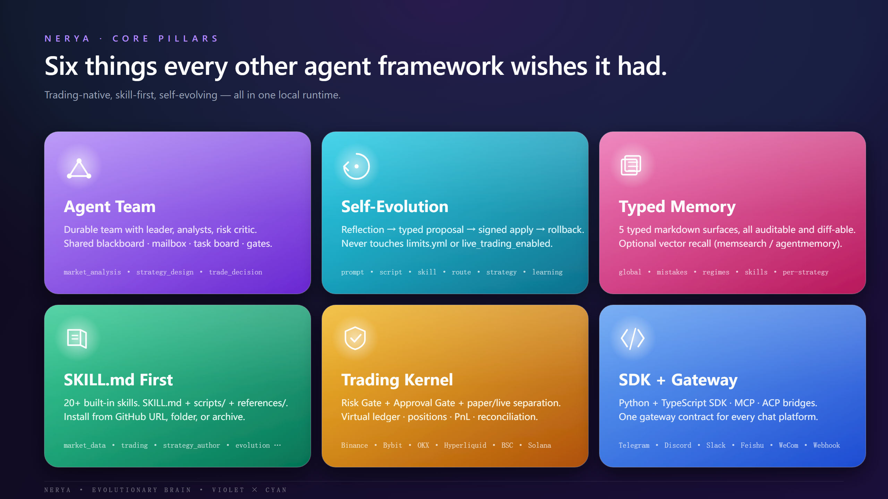
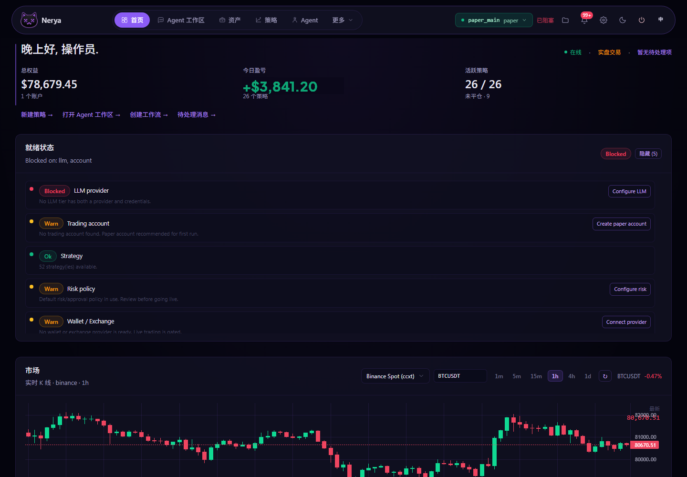
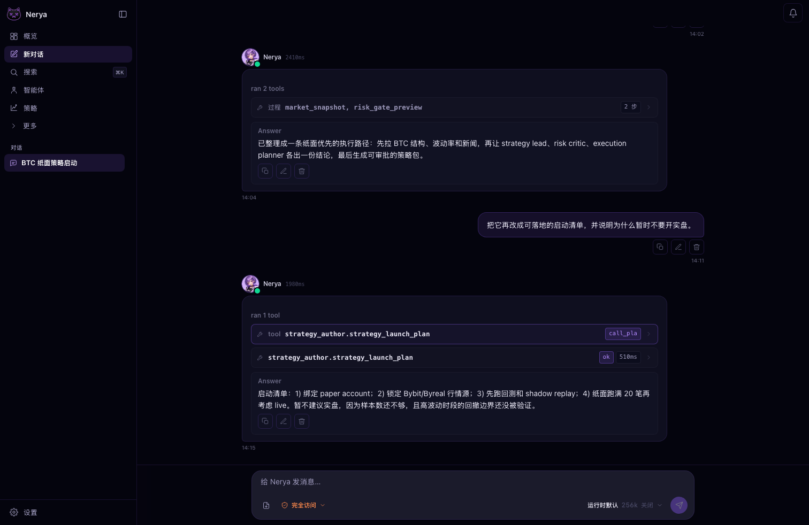
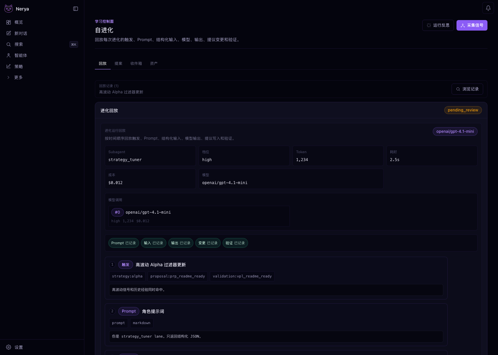

<p align="center">

</p>

<div align="center">

# Nerya

### 本地运行的投研 Agent 团队，让你的交易策略自我进化

Nerya 在你自己的机器上跑一支完整的投研团队。策略队长负责调度全局，市场、链上、新闻、
技术面分析师分头收集证据，风控批评家给每一个论点做压力测试，组合经理核对敞口。团队起草
策略，让它们过一遍 Risk Gate 和 Approval Gate，再把每个会话沉淀下来的证据，变成需要操作员
签字的补丁：提示词、技能、脚本、触发器、策略配置——所以每一版策略都比上一版更强。

[English](README.md) · [简体中文](README.zh-CN.md)

[](https://polyformproject.org/licenses/noncommercial/1.0.0)
[](LICENSE)
[](https://www.python.org/downloads/)


</div>

---

## 最近更新

- **Git / WebDAV 工作区同步**：可以从 Dashboard 或工作区 API 推送、拉取 Nerya
  工作区，运行时状态仍然保留在本地，并由操作员明确控制。
- **统一的持久记忆运行时**：会话记忆、反思写入、上下文压缩、原生工具和 Memory API
  现在共用同一套带作用域的存储与投影模型，不再各走一套召回逻辑。
- **隔离的策略调优审阅**：调优只读取被选中策略包及其证据范围，避免其他策略或运行时
  上下文串进审阅结果。
- **实盘交易链路加固**：CCXT 衍生品订单现在完整传递交易所精度、合约单位、
  `reduce-only`、杠杆、保证金模式、持仓索引和原生止损/止盈参数。
- **更深的金融工作流**：新增专家投资者、财经创作者和量化策略循环等内置技能，
  把研究视角和策略迭代流程按需加载，不膨胀常驻 Agent 提示词。

---

## 六大核心

<p align="center">

</p>

---

## Nerya 跟其他 Agent 框架不一样在哪

|   | 市面上的 Agent 框架 | Nerya |
|---|---|---|
| **交易能力** | 套个壳直接调交易所 SDK | 原生 Risk Gate、Approval Gate、纸面/实盘分离、虚拟账本、对账 |
| **记忆** | 随手糊一个向量库 | 5 份带语义的 markdown 记忆面：全局、错题本、行情画像、技能心得、策略复盘 |
| **自我进化** | 你给它写 prompt | 反思自动出提案，操作员签字，运行时上线还留快照 |
| **多 Agent** | 几个 function call 串一下 | 持久化的投研团队：策略队长、市场/链上/新闻/技术面分析师、风控批评家、组合经理、共享黑板、任务板、邮箱、审批门 |
| **连接器** | 一家一套 SDK | Binance、Bybit、OKX、Hyperliquid、PancakeSwap、Jupiter、通用 EVM，再加 CCXT 桥的 100+ 家。**还没？让 Agent 自己写一个**。 |
| **安全** | 「别把 key 打进日志」 | 密钥只进 Vault；prompt 里只看 `vault://` 引用；提示词防火墙、签名策略、脚本沙箱 |
| **运维** | 自己写 supervisor | 一行命令装好，自动注册 systemd / launchd / NSSM 系统服务 |

---

## 截图

### 操作员主页



一屏看完：总净值、当日盈亏、活跃策略、持仓、装机进度（LLM、交易账户、风控、钱包/交易所，
绿/黄/红三档），右边再挂一张你配置的交易所实时 K 线。

<br/>

### Agent 工作台



> _「写个监控脚本。新建一个子智能体。每分钟跑一次心跳。给我做一次复盘。」_

每条消息跑一回合：planner 选路由 → 调工具 → 把产物落盘。每条消息都能单独调：

| 旋钮         | 干嘛用的                                                       |
|--------------|----------------------------------------------------------------|
| Think 模式   | 强制 planner 先把行动计划写出来，再去调工具                    |
| 模型档位     | `light` / `medium` / `high` / `intent`，在成本和能力之间挑     |
| YOLO         | 便宜的回合跳过额外审查直接跑                                   |
| 迭代上限     | 这条消息最多允许 Agent 循环几次                                |
| 工具预算     | 跑到 N 次工具调用就强制结束本回合                              |
| 回合预算     | 这一回合能花的 LLM token 上限                                  |

工作台自带 4 个起步提示词：写监控脚本、建子智能体、挂心跳、跑复盘。点一下就开跑。

### 自我进化审阅台



把一次进化 run 的全过程摊开给操作员看：触发、角色提示词、结构化输入、模型调用、提议改动、
验证预览、候选评分、lineage 上下文，全都在一个页面里审。任何提案在被批准或晋升前，都先过这道面板。

### 其他 Dashboard 页面

- `setup` 复用 `nerya setup --tui` 的同一套引导：密码、LLM、网关、记忆、浏览器、交易账户、网页搜索。
- `skills` 以 `SKILL.md` 为唯一技能定义入口，统一浏览内置技能、工作区覆盖、已安装技能和仓库导入。
- `memory` 管 notebook、证据、画像和多后端配置，想接 `memsearch` 或外部 `agentmemory` 也都在这里。
- `portfolio` 把交易所账户和钱包合到一份报表账本里，看余额、敞口、对账状态和净值历史。
- `agents` 管持久化子智能体：角色提示词、技能白名单/黑名单、工作区 persona 都在一处维护。
- `gateway` 把 Telegram、Discord、Slack、飞书、企业微信、钉钉、WhatsApp 和 webhook 的投递统一收口，密钥一律改写成 `vault://` 引用。

> Dashboard 就在 `dashboard/`（Next.js 14、App Router，`:18380`）。下面一行命令跑起来，
> 没云账号，没遥测，全程本地。

---

## 核心能力

### Agent Team

一个 `TeamRun` 就是给策略队长的一张持久化投研台，不是 LLM 并行调一下完事。分析师分头覆盖
各条线，风控批评家把住下行，组合经理管住敞口。它带：

- 角色分明：策略队长、市场分析师、链上分析师、新闻分析师、技术面分析师、风控批评家、
  执行规划员、组合经理
- 投研覆盖分到价格与行情、链上资金流、新闻与情绪、技术面各条线，再综合成一个站得住脚的论点
- 每个角色独立的技能黑/白名单——比如 `execution_planner` 就不让动 `trading`
- 任务板，支持依赖、锁、优先级、Owner
- 邮箱让成员相互留言、广播；共享黑板让所有证据落盘，谁都能引用
- 队长综合：等齐必需角色的报告，解决冲突，输出决策备忘
- 审批门：方案产出门、任务全完成门、验证门、可选的人工审批门

内置三个模板：`market_analysis_team`（市场分析）、`strategy_design_team`（策略设计）、
`trade_decision_committee`（交易决策委员会）。要自己加直接丢到 `nerya/teams/templates` 里。

### 自我进化

Nerya 的策略不是一成不变的。每个收尾的会话都会变成证据，Agent 用它把下一版策略打磨得更锋利，
并适应当前的行情。每个会话收尾，`nerya/agent/reflection.py` 把心得写进记忆。`nerya/evolution/`
再把这些记忆变成结构化的进化提案：

```
learning_update        记忆 markdown 补丁
prompt_patch           agent / subagent 提示词 unified diff
script_proposal        新脚本 + manifest，落到 workspace/scripts/pending/
skill_proposal         新技能目录，落到 workspace/skills/pending/
trigger_route_patch    workspace/triggers/routes.yml 补丁
strategy_config_patch  strategies/<id>/strategy.yml 补丁
risk_limit_suggestion  只建议，永远不会自己覆盖 limits.yml
```

代码硬性兜底：agent 起草的补丁永远碰不到 `accounts.yml`、`limits.yml`、vault、签名策略、
`live_trading_enabled`——`promotion.py` 拦在那里直接拒。每个被采纳的提案都自带快照，
想回滚一句话的事。

### 记忆

```
workspace/memory/
├── global.md                       全局笔记
├── mistakes.md                     错题本（反思写，agent 读）
├── market_regimes.md               行情画像（每周复盘 + 新闻技能写）
├── skill_learnings.md              每个技能的心得
└── strategy_learnings/<id>.md      每个策略的复盘
```

纯 markdown。人能读、能 diff、能 git。塞进 prompt 之前一律过提示词防火墙。

### 技能（Skill）

每个能力一个文件夹，路径在 `nerya/skills/builtin/<name>_skill/`：

```
SKILL.md       什么时候用、工作流、示例
scripts/       可执行助手，JSON 进、JSON 出
references/    按需懒加载的方法论、研究剧本
templates/     代码、配置模板
```

内置 25 个技能，分成五大家族：

- **交易与策略**：`trading`、`strategy_author`、`backtest`、`triggers`、`tasks`
- **市场与数据**：`markets`、`market_data_routing`、`news_social`、`research`、`analysis`
- **研究与估值**：`market_research`、`quant_research`、`equity_research`、`dcf_valuation`、
  `sec_filings`、`research_report`、`expert_investors`
- **Agent、记忆与成长**：`agents`、`team`、`memory`、`evolve`、`llm`
- **构建与连接**：`coding`、`browser`、`notify`

其中「研究与估值」这一族本身就是一支完整的投研团队：多源市场研究、因子与信号验证、个股深挖、
DCF 估值、SEC 申报、具名投资者视角，以及研报生成。

### 交易内核

```
TradeIntent → RiskGate → ApprovalGate → 纸面执行 | 实盘连接器
                                                 │
                                                 ▼
                              虚拟账本 · 持仓 · PnL · 对账
```

- **Risk Gate**：实盘状态、限额、虚拟账本、置信度、滑点、过期、重复、冲突，一项不过就拦。
- **Approval Gate**：超阈值的单子自动挂到操作员审批队列。
- **Strategy History**：触发、上下文、决策、意图、风控判定、执行、消息、结果、复盘、反思，
  全写进一份 JSONL 会话日志。审计、回放、复述决策链都靠它。
- **CEX**：原生 CCXT 适配器，Binance、Bybit、OKX、Hyperliquid 真签名下单全跑通。
- **链上**：BSC（PancakeSwap v2）、Solana（Jupiter）、通用 EVM，`eth_account` 签名。

### 你的交易所没列出来？让 Agent 自己适配

不用等版本更新，直接跟 Agent 说就行：

> **你：** 帮我接一下 Bitget 永续，API 文档在这：https://bitgetlimited.github.io/apidoc/en/

`coding` 技能先查 CCXT（100+ 家已经接好的）——命中就加个别名直接用。
没命中的话，Agent 会在 `workspace/providers/<id>/provider.py` 里现写一个 Provider，
吐一个 `SPEC` 常量出来，再调 `ConnectorRegistry.reload_providers()` 热加载，
最后用 `connector_view` 验一下。**不用重启 Daemon，也不用动源码**。等这家交易所稳定了，
维护者把工作区里那份挪进 `nerya/connectors/` 就算转正。

### 触发器（Triggers）

`workspace/triggers/routes.yml` 把 `kind` 路由到目标：主 agent、子 agent，或者直接调技能。
内置 kind：cron、webhook、网关入站、价格突破、资金费率异常、新闻关键词、巨鲸钱包、
策略会话结束、操作员手触。幂等键、dry-run、去重都内置。

### 网关（Gateway）

Telegram、Discord、Slack、飞书、企业微信、钉钉、WhatsApp、通用 Webhook。

- `GET /gateway/platforms` 返回支持矩阵
- `POST /gateway/inbound` 收归一化的入站消息
- `POST /gateway/send` 走原生通道或 Webhook 出站
- 成交通知通过 `messaging/pipeline.py` 扇出到所有配置过的频道
- Telegram 在 Agent 回完之前一直保持「正在输入」状态

### SDK

SDK 不碰密钥、不碰交易所、不碰 RPC。它就是本地 Daemon 的瘦客户端，每次调用都得过技能权限、
Risk Gate、Approval Gate。

```python
from nerya_sdk import connect

client = connect()
client.triggers.emit(
    source="script",
    kind="price.breakout",
    payload={"symbol": "BTC", "price": 82_000},
    target="subagent:market_analyst",
    strategy_id="btc_momentum",
)
```

```ts
import { connect } from "@nerya/sdk";

const nerya = connect({ baseUrl: "http://127.0.0.1:18317", caller: "script:my_bot" });
await nerya.trading.submitIntent({
  strategy_id: "btc_momentum",
  account_id: "paper_main",
  market: "PAPER:BTCUSDT",
  side: "buy",
  size: 0.01,
  size_unit: "base",
  order_type: "market",
  confidence: 0.6,
  reasoning: "ts-sdk demo",
});
```

---

## 三分钟从零跑起来

### 一行装好

```bash
# macOS / Linux
curl -LsSf https://raw.githubusercontent.com/NeryaAI/Nerya/main/install/install.sh | sh

# Windows PowerShell
iwr https://raw.githubusercontent.com/NeryaAI/Nerya/main/install/install.ps1 -UseBasicParsing | iex
```

仓库还是私有时，匿名访问 `raw.githubusercontent.com` 会直接返回 `404`。
上面这组命令就是以后公开仓库时的正式入口。

安装脚本是幂等的，跑几次都没事。它会：

1. 没装 [`uv`](https://github.com/astral-sh/uv) 就给你装一个
2. 把 Nerya 源码拉到 `~/.nerya/src` 并跑 `uv sync --extra trading`
3. 把 `nerya` 命令丢到 `~/.local/bin`（POSIX）或 `%USERPROFILE%\.local\bin`（Windows）
4. 在 `~/nerya-ws` 起一份工作空间
5. 注册系统服务（`systemd --user` / `launchd` / NSSM），开机自动把本地 API 起到 `18317` 端口

### 小白模式

```bash
nerya setup --tui      # 富文本向导：密码、LLM key、网关、记忆、账户一步步带你过
nerya setup --web      # 浏览器打开同一份向导：http://127.0.0.1:18317/setup
```

除了 LLM key，其它每一步都有安全默认值。一路回车也能装出能跑的环境。

装完打开 Dashboard，直接说人话就行。没有策略也没关系，扔一句给它，它自己写：

> **你：** 我有 500 块纸面账户的钱，帮我做 BTC，别给我亏光。
>
> **Nerya：** _起草 `demo_btc_5m_scalper` 策略包，接上 `binance:BTCUSDT` K 线，
> 绑定 `paper_main` 账户，加一道 0.4% 最大回撤保护，每 5 分钟跑一次，等你点批准。_

点批准它就开跑。每个决策写 journal，每笔成交自动复盘，每轮会话结束触发反思，
反思产出的提案等你签字才能升级 prompt、加新脚本、改风控参数。

实盘默认是关的。你不签字，Agent 自己永远改不掉这一行配置。所以它会犯的错只会进它的记忆，
不会进你的钱包。

### 手动跑（不走安装脚本）

```bash
# 1. 起一份工作空间
python -m nerya.cli.app init --workspace ~/.nerya

# 2. 看一眼装了哪些技能
python -m nerya.cli.app skill list

# 3. 跑一遍垂直切片 Demo（纸面交易，不需要任何实盘 key）
python sdk/python/examples/price_tracker.py --workspace ~/.nerya

# 4. 复盘一下刚才跑出来的策略会话
python -m nerya.cli.app strategy history btc_momentum --workspace ~/.nerya

# 5. 反思 + 生成进化提案
python -m nerya.cli.app reflect  --workspace ~/.nerya
python -m nerya.cli.app evolve   --workspace ~/.nerya
python -m nerya.cli.app proposals list --workspace ~/.nerya
```

### Windows 一键开 Dashboard

```powershell
pwsh -File .\scripts\windows\start-local.ps1 -OpenDashboard
```

脚本幂等，点几次都没事。API 在 `:18317`，Dashboard 在 `:18380`，日志在 `~/.nerya/logs/`。

---

## 架构一图流

```
┌──────────────────────────── Nerya 运行时 ────────────────────────────┐
│                                                                       │
│   ┌──────────────────┐   ┌─────────────┐   ┌──────────────────────┐   │
│   │ 触发器路由        │──►│ Nerya 内核   │──►│ 技能运行时            │   │
│   │ 定时/自然语言/    │   │ Agent 主循环 │   │ 注册表 + 分发         │   │
│   │ Webhook / 网关   │   │  + 规划器    │   │ 权限校验 + Manifest   │   │
│   └──────────────────┘   └──────┬──────┘   └───────────┬──────────┘   │
│                                 │                      │              │
│                                 ▼                      ▼              │
│   ┌─────────────┐   ┌─────────────┐   ┌──────────────────────────┐    │
│   │ LLM 网关    │   │ 子智能体 +  │   │  交易内核                │    │
│   │ 多档位 +    │   │ Agent Team  │   │  意图 → Risk Gate →      │    │
│   │ 预算控制 +  │   │ 黑板 + 邮箱 │   │  Approval Gate →          │    │
│   │ 多适配器    │   │             │   │  纸面/实盘执行            │    │
│   └─────────────┘   └─────────────┘   └──────────────┬───────────┘    │
│                                                      │               │
│   ┌─────────────┐   ┌─────────────┐   ┌──────────┐   │               │
│   │ 消息网关     │   │ 安全       │   │ MCP /    │   │               │
│   │ 出站管道     │   │ Vault +    │   │ ACP      │   │               │
│   │              │   │ 签名 +     │   │ 桥接     │   │               │
│   │              │   │ 防火墙     │   │          │   │               │
│   └─────────────┘   └─────────────┘   └──────────┘   ▼               │
│                                       策略历史 + 各类 journal         │
└───────────────────────────────────────────────────────────────────────┘
                                    │
                                    ▼
┌─────────────────── Nerya 工作空间（纯文件，归你所有）─────────────────┐
│  state/ journals/ inbox/ outbox/ memory/ vault/ approvals/            │
│  strategies/<id>/{strategy.yml, limits.yml, history/, sessions/}      │
│  skills/{enabled.yml, installed/, pending/}                           │
│  scripts/{pending/, approved/, rejected/}                             │
│  evolution/proposals/                                                 │
└───────────────────────────────────────────────────────────────────────┘
```

代码在仓库里。运行时的所有状态（策略、日志、会话、审批、记忆、Vault、提案）都落在你自己的
工作空间。想备份 `tar`，想查 `cd`，想清空 `rm -rf` 完事。

---

## SDK 一览

| 形态       | 路径                                  | 干嘛用的                                                  |
|-----------|---------------------------------------|----------------------------------------------------------|
| Python    | `sdk/python/nerya_sdk/`               | 本地 Daemon 的瘦客户端：触发器、交易、LLM、策略、记忆       |
| TypeScript | `sdk/typescript/` → `@nerya/sdk`     | 同一套接口，Node、Bun、Edge 都能跑                         |
| MCP       | `nerya/mcp/`                          | 把每个技能暴露成 MCP 工具，Claude Desktop、Cursor 直接接进来 |
| ACP       | `nerya/acp/`                          | Agent 之间的协议桥，跨群协作用                             |

```bash
# Python SDK 示例
python sdk/python/examples/price_tracker.py          # 触发 → 子智能体 → 纸面成交
python sdk/python/examples/news_alpha_watcher.py     # 轻量 LLM + 高档 LLM 二段过滤
python sdk/python/examples/direct_order_strategy.py  # 直接下单，依然过 Risk Gate
python sdk/python/examples/funding_spike_trigger.py  # 永续资金费率异常触发
python sdk/python/examples/whale_wallet_trigger.py   # 巨鲸钱包活动触发
```

---

## 安全设计

- 默认纸面交易。实盘必须 `runtime.live_trading_enabled: true` 而且过 Approval Gate 才行。
- Agent 上下文里看不到原始密钥，只有 `secret_ref` 和脱敏预览。`SecretVault` 解析
  `vault://` 引用是内存里临时解一次，调用完立刻丢。
- Agent 写的代码碰不到交易所。所有外部调用都得过技能、连接器、签名器三道关。
- 脚本沙箱化：白名单 import、JSON 输入输出、必须批准才能跑，绕不过 Trading SDK + Risk Gate。
- 进化能改 prompt、脚本、技能、路由、策略配置；改不了 `limits.yml`、`live_trading_enabled`、
  签名策略、密钥策略——`promotion.py` 拦在那里直接拒。

---

## `nerya/*` 里到底装了什么

| 模块                 | 负责什么                                                                                          |
|----------------------|---------------------------------------------------------------------------------------------------|
| `agent/`             | Kernel、Planner、上下文构建、记忆、工作内存、反思引擎                                              |
| `subagents/`         | 类型化子智能体运行时、技能黑/白名单、预算上限、并行分发器、结果聚合                                  |
| `teams/`             | Agent Team：配置、存储、邮箱、黑板、模板、编排器、审批门、综合器                                    |
| `triggers/`          | Cron + 触发器路由、`schedules.yml`、幂等键、dry-run                                                |
| `skills/`            | `SKILL.md` 内核 + 25 个内置技能，覆盖交易、数据、投研、Agent 与构建                                |
| `trading/`           | TradeIntent、RiskGate、ApprovalGate、纸面执行、虚拟账本、持仓、PnL、对账                           |
| `connectors/`        | CCXT 适配器（Binance/Bybit/OKX/Hyperliquid）、原生 EVM/BSC/Solana、动态 Provider Spec               |
| `wallet/`            | 自托管、OKX OS、Bitget、Binance Agentic、Coinbase 钱包提供商                                       |
| `llm/`               | ModelRouter、OpenAI/Anthropic/Gemini/Ollama 适配器、凭证池、压缩、档位、预算                       |
| `security/`          | Vault、签名器、提示词防火墙、脱敏、结构化输出校验、脚本沙箱                                         |
| `evolution/`         | 反思引擎、类型化提案、操作员签字应用、快照回滚                                                      |
| `strategy_history/`  | 每个策略一份 JSONL 账本、会话工件、回放                                                            |
| `messaging/`         | 统一网关：Telegram、Discord、Slack、飞书、企微、钉钉、WhatsApp、Webhook                            |
| `mcp/`, `acp/`       | FastMCP 服务器 + ACP 适配器，把技能桥接到外部 Agent 生态                                            |
| `install/`           | 跨平台服务（systemd、launchd、NSSM）安装器                                                         |
| `sdk/`               | 进程内 InternalClient + Trigger / Trading / LLM / Strategy / Message / Skill 接口                  |

---

## 跑测试

```bash
python -m pytest tests/
```

500+ 个测试，覆盖：技能 manifest、触发器路由（去重、dry-run、子智能体路由）、排程器
生命周期、Trading SDK（风控门、紧急停机、超仓、低置信度、纸面成交、策略会话创建）、
LLM 网关与 OpenRouter 风格的多 Provider 路由、模型目录刷新、密钥脱敏、脚本沙箱、
反思与进化、策略历史与 explain-trade、子智能体与 Agent 主循环、动态连接器发现与热加载、
CEX 实盘签名下单（Binance、Bybit、OKX、Hyperliquid）、DEX 实盘签名兑换
（BSC PancakeSwap、Solana Jupiter）、MCP 与 ACP 适配器、Dev 模式 journal、服务安装器。

测试不联网。LLM 用 `FakeTransport`，交易所用 `mock_exchange.py` / `mock_chain.py`，
端到端的 LLM 行为靠确定性的 `<<MOCK_DECISION:{…}>>` 钩子驱动。

---

## 端口

默认只占一个本地端口：`18317`。Daemon、系统服务、Dashboard 代理、SDK 全在这一个口上。
想换口，给 `nerya serve` 或 `nerya service install` 加 `--port`，Dashboard 和 SDK
用 `NERYA_API` 环境变量指过去就行。

---

## 进度

- ✅ 垂直切片端到端跑通：`init → skill list → 触发 → 子智能体回合 → TradeIntent →
  Risk Gate → 纸面成交 → 策略历史 → 复盘 → 反思 → 提案`。
- ✅ Agent Team Phase 1–4 已经在了：持久化团队核心、模板、编排器、Planner/Kernel 接入、
  技能 + HTTP 接口。Phase 5（快照/回放/团队结束写入记忆）延后。
- ✅ Binance、Bybit、OKX、Hyperliquid 真实签名下单和撤单。BSC（PancakeSwap v2）、
  Solana（Jupiter）真实签名兑换。
- ✅ 跨平台一行安装 + 系统服务注册。
- ✅ Dashboard（Next.js 14）：Setup 向导、Chat、策略、自我进化、记忆、技能、
  Workflows、收件箱、组合、网关、Env Vault、设置。
- 🚧 Agent Team Phase 5：快照、回放。
- 🚧 更多网关原生适配器：飞书富卡片、Discord 斜杠命令、WhatsApp Business。

---

## 许可

Nerya 用 [PolyForm Noncommercial 1.0.0](https://polyformproject.org/licenses/noncommercial/1.0.0)
发布。完整许可见仓库根目录的 [`LICENSE`](LICENSE)。

- ✅ **个人免费用**：学习、研究、爱好项目、写论文、跑自己的纸面或实盘账户管自己的钱——
  全免费。可以读、可以改、可以 fork、可以分发。
- ✅ **非营利组织、学校、公共研究机构免费用**：许可证里写得清清楚楚。
- ❌ **商业用途要单独授权**：包括但不限于把 Nerya 包成 SaaS / 托管服务对外卖、嵌进收费产品、
  在公司内部的交易/做市/资管业务里跑、给客户提供付费的策略代跑或代部署。

想商业授权？在 GitHub 开个 issue 写明用途，或者按 [`LICENSE`](LICENSE) 末尾「Commercial Use
Addendum」里写的邮箱联系维护者就行。

---

<div align="center">

写给那些想要一个能思考、能交易、能记住教训、还能自己迭代的 Agent，又不肯把热钱包密钥
托付给 SaaS 的操作员。

<sub>Nerya · Evolutionary Brain</sub>

</div>
